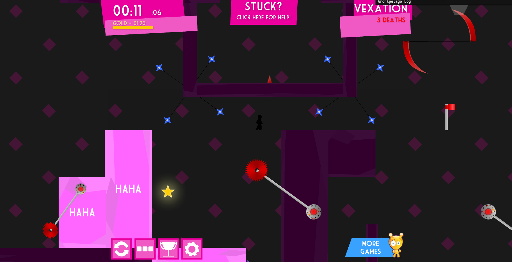
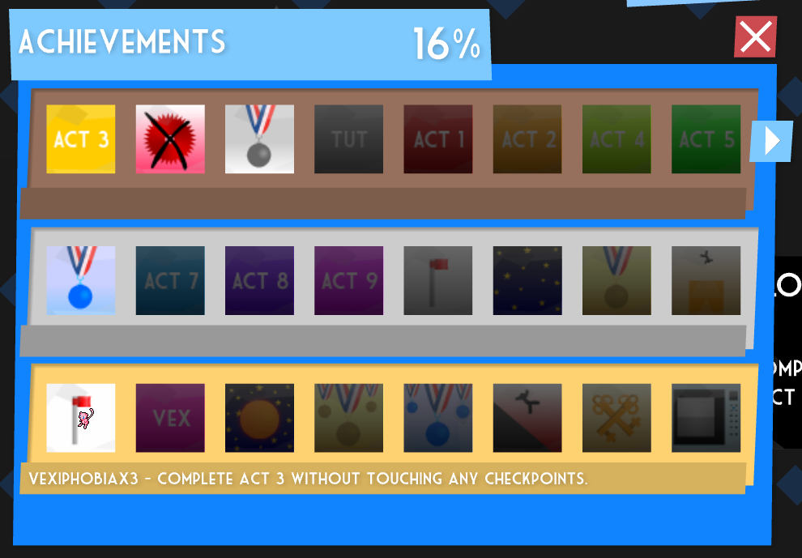

to download download the repo and get the newest release of vex2-modded.swf from the releases section, if compiling have ffdec and RABCDAsm then download the repo and run ./compile

to start run ./start and open http://127.0.0.1:4541

to use offline on the webpage type /installsw and the game will be available offline

---

vex 2 is a platformer made in actionscript/flash

---

each achievement is a check eccpet `time flies`, `light cardio`, and `mini maraton` as these require no skill and only time to get

each star is a check

each level beaten is a check

---

all the moves `duck/slide`, `pull lever`, `swim`, `bounce`, `walljump`, `polejump`, `pulley`, `portal`, `cannon`, and `kick pushable box` are items

all the level unlocks are items

water and bounce blocks when not having the corresponding move will kill you to interact with them, the rest just do nothing

level 3 can be beaten without checkpoints just like level 0 so there is also a check for that

---

win conds are get all acevivements or beat all levels

